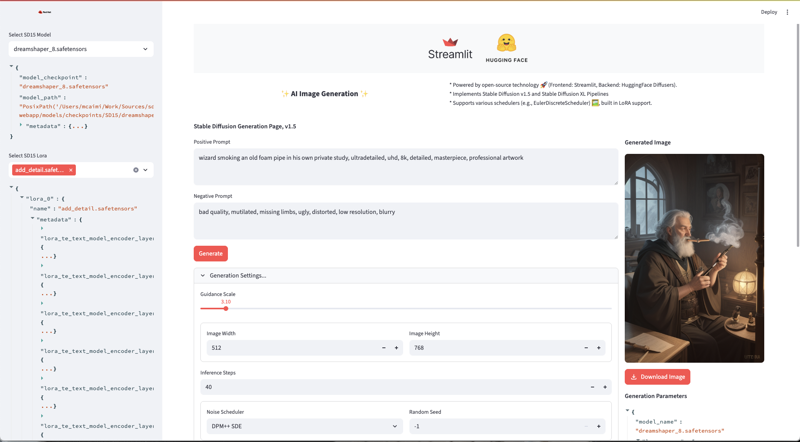

# Stable Diffusion Web App

This is a Stable-Diffusion Web Application written using Streamlit, Pytorch/Torchvision and HuggingFace Diffusers
With proper hardware, it can generate images locally from pre-trained Stable Diffusion Models.

To download model checkpoints, have a look at [HuggingFace](https://huggingface.co/models?pipeline_tag=text-to-image&library=safetensors&sort=trending).



## Run Locally

The application expects to find model checkpoints files in the `models/stable-diffusion` folder, and loras in `models/loras` folder.

```
$ uv run streamlit run main.py
```

It tries to use any discovered GPU that is supported by pytorch, but it can run on CPU (*very* slowly)

Tested:
- Apple Metal Performance Shaders
- NVIDIA CUDA
- AMD CPU

