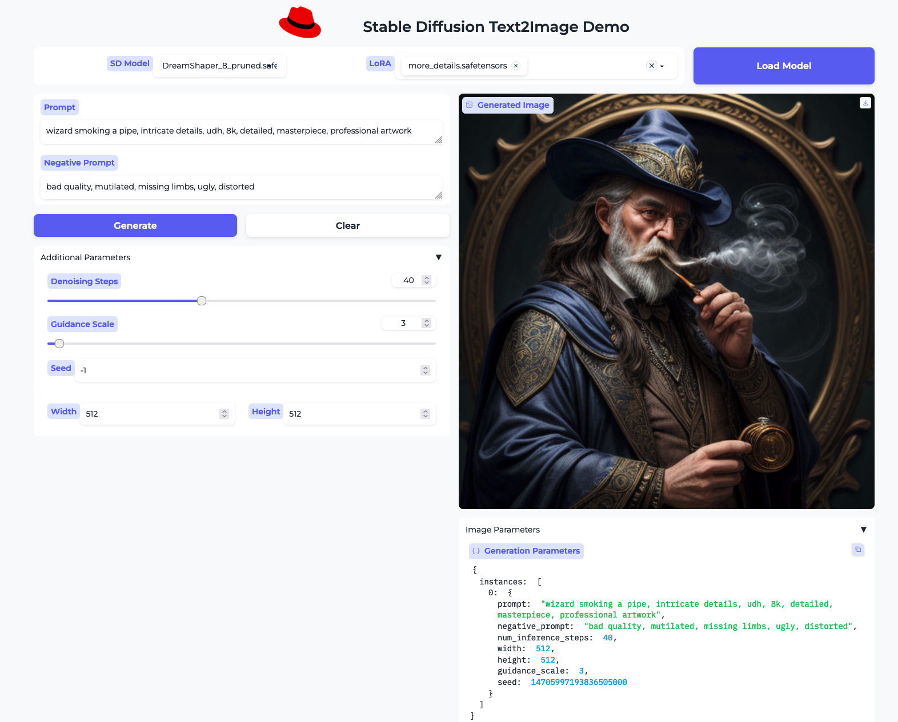

# Stable Diffusion Web App

This is a Stable-Diffusion Web Application written using Gradio and FastAPI.
It exposes a way to perform inference with a Stable Diffusion compatible model in the backend.



## Run Locally

The application expects to find model checkpoints files in the `models/stable-diffusion` folder.

```bash
# development mode
$ fastapi dev

# production mode
$ fastapi run
```

It tries to use any discovered GPU that is supported by pytorch, but it can run on CPU (*very* slowly)

Tested:
- Apple Metal Performance Shaders
- NVIDIA CUDA
- AMD CPU

